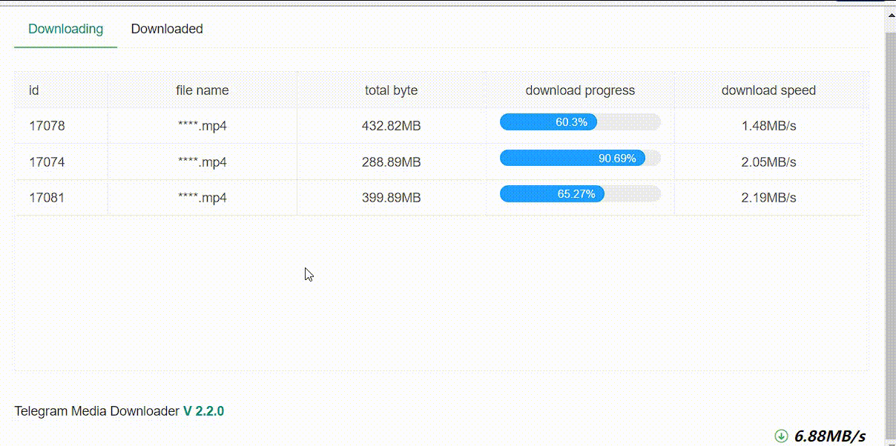

<h1 align="center">Telegram Media Downloader</h1>

<h3 align="center">
  <a href="./README_CN.md">中文</a> · 
  <a href="https://github.com/tangyoha/telegram_media_downloader/discussions/categories/ideas">Feature request</a>
   · 
  <a href="https://github.com/tangyoha/telegram_media_downloader/issues">Report a bug</a>
   · 
  Support: <a href="https://github.com/tangyoha/telegram_media_downloader/discussions">Discussions</a>
   & 
  <a href="https://t.me/TeegramMediaDownload">Telegram Community</a>
</h3>

### Overview

Download all media files from a conversation or a channel that you are a part of from telegram.
A meta of last read/downloaded message is stored in the config file so that in such a way it won't download the same media file again.

### UI

### This project has been migrated to https://github.com/tangyoha/telegram_media_downloader

